# 📈 Stock Movement Predictor

A machine learning-based stock market prediction system built using Python and Streamlit that predicts the **next-day stock price direction (UP/DOWN)** using technical indicators and multiple classification models.

This project combines:

- 📊 Financial data analysis
- 🤖 Machine learning models
- 🔍 Automatic outlier detection & treatment
- 📈 Interactive visualizations
- 🎯 Real-time stock prediction interface

---

## 🚀 Features

### 📌 Prediction Models
The system uses three machine learning algorithms:

- Logistic Regression
- Support Vector Machine (SVM)
- Random Forest Classifier

It also supports:

- ✅ Ensemble prediction
- ✅ Confidence score calculation
- ✅ Probability estimation

---

## 📊 Technical Indicators Used

The application automatically generates financial indicators such as:

- SMA (10, 20, 50)
- EMA (12, 26)
- MACD & MACD Signal
- RSI
- Bollinger Bands
- ATR (Average True Range)
- Volatility
- Volume Ratio
- Daily Returns

---

## 🔍 Automatic Outlier Detection & Treatment

The project includes a complete outlier handling pipeline:

### Detection Methods
- IQR Method
- Z-Score
- Modified Z-Score (MAD)

### Automatic Selection Logic
The system automatically selects the best method using:

- Skewness
- Kurtosis
- Shapiro-Wilk Normality Test

### Treatment Techniques
- Winsorization
- IQR Clipping
- Median Imputation
- Log Transformation

---

## 🖥️ Interface Modes

### 🔵 Basic Mode
- Clean prediction interface
- Quick stock movement prediction
- Confidence visualization

### 🟣 Advanced Mode
Includes:
- EDA Dashboard
- Correlation Heatmaps
- RSI & MACD Analysis
- Outlier Reports
- Feature Distribution Analysis
- Model Performance Metrics

---

## 📈 Visualizations

Interactive charts powered by Plotly:

- Candlestick Charts
- Volume Analysis
- RSI Graph
- MACD Histogram
- Feature Correlation Heatmap
- Outlier Comparison Charts

---

## 🛠️ Technologies Used

### Programming Language
- Python

### Libraries & Frameworks
- Streamlit
- Pandas
- NumPy
- Scikit-learn
- Plotly
- SciPy
- yFinance

---

## 📂 Project Structure

```bash
├── stock_predictor_full.py
├── requirements.txt
├── README.md
```

---

## ⚙️ Installation

### 1️⃣ Clone the Repository

```bash
git clone https://github.com/your-username/stock-movement-predictor.git
cd stock-movement-predictor
```

---

### 2️⃣ Install Dependencies

```bash
pip install -r requirements.txt
```

---

### 3️⃣ Run the Application

```bash
streamlit run SP.py
```

---

## 📦 Requirements

```txt
streamlit
yfinance
pandas
numpy
scikit-learn
plotly
scipy
```

---

## 📊 Machine Learning Workflow

```text
Data Collection
      ↓
Feature Engineering
      ↓
Outlier Detection
      ↓
Outlier Treatment
      ↓
Data Scaling
      ↓
Model Training
      ↓
Prediction
      ↓
Visualization
```

---

## 🎯 Prediction Output

The system predicts:

- 📈 UP Movement
or
- 📉 DOWN Movement

Along with:

- Prediction probability
- Confidence percentage
- Model agreement score

---

## 📸 Snapshots

<div align="center">

###  **Home-Page**
*Home Page*

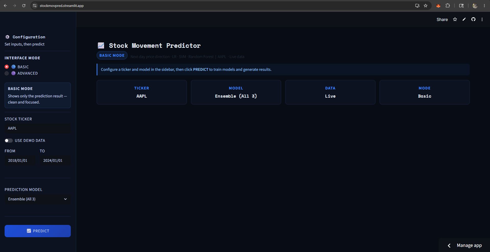

###  **Basic Mode**
*Prediction in Basic Mode*

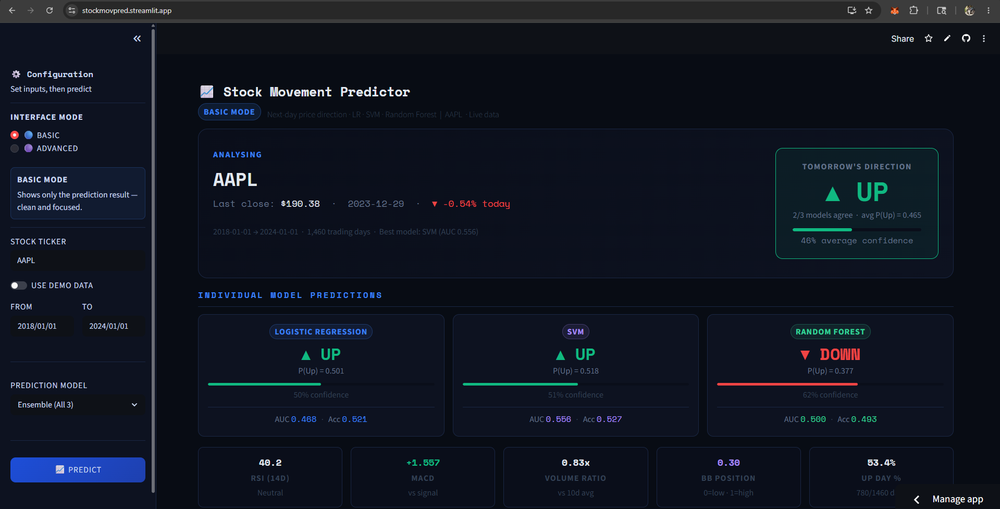

*Visualization in Basic Mode*

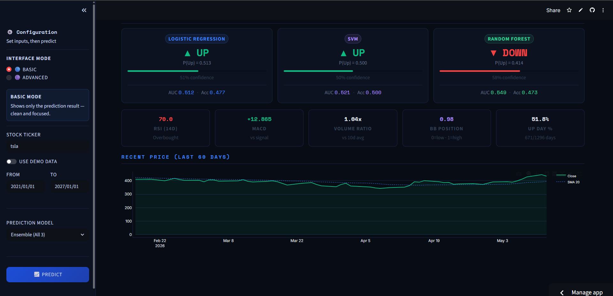

###  **Advance Mode**
*Dataset tab*

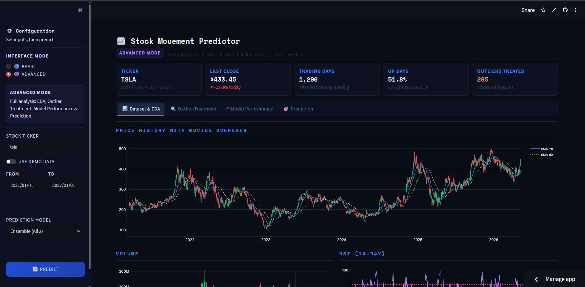

*Dataset Visualizations*

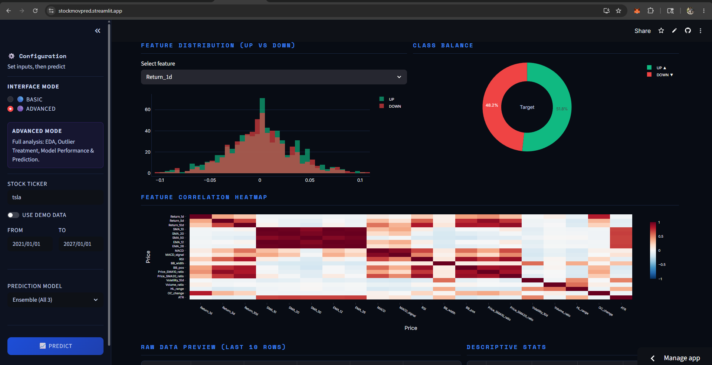

*Outliers tab*

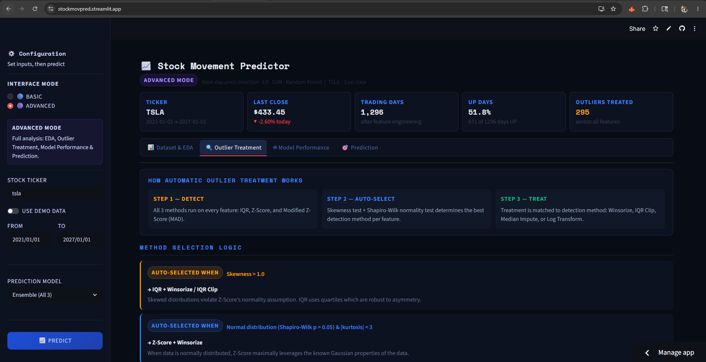

*Outlier treatment visualizations*

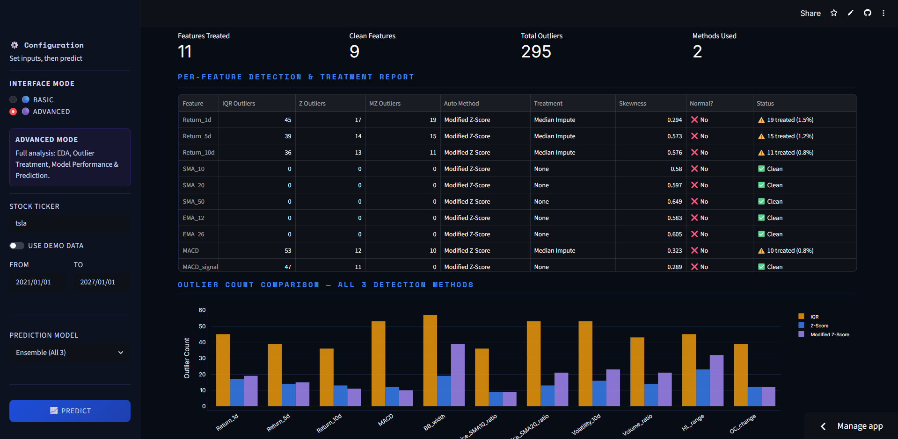

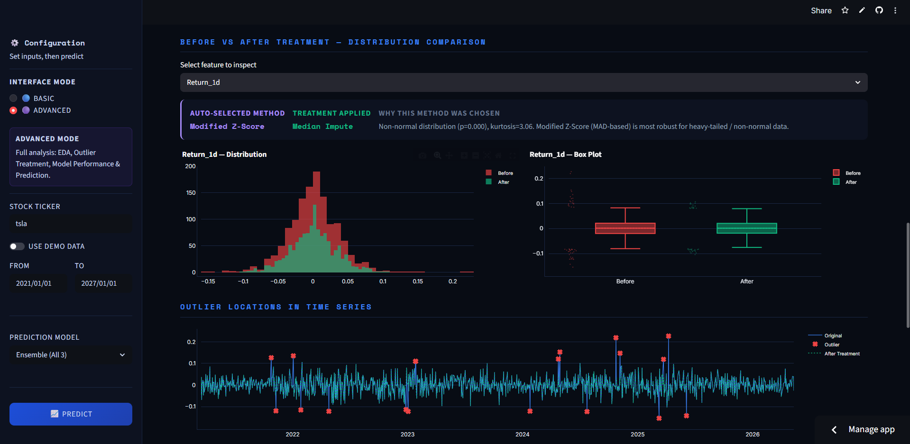

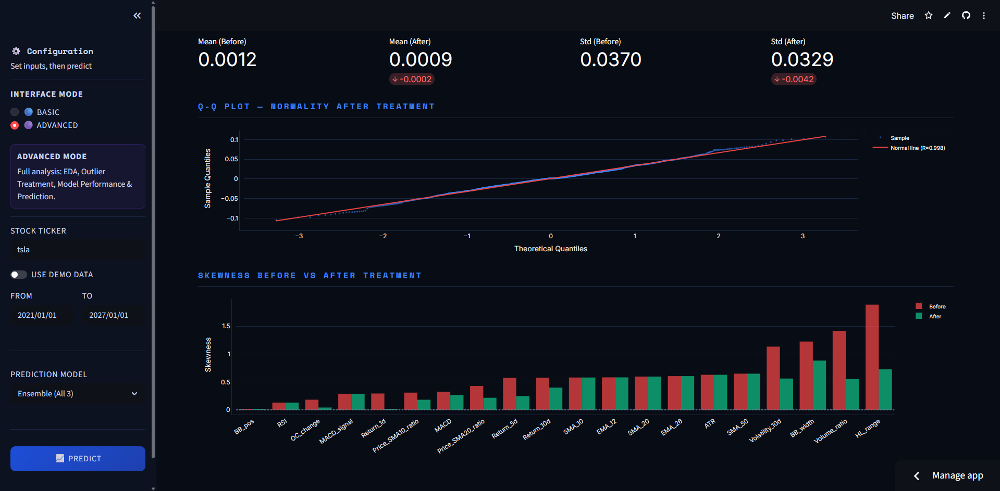

*Model Performance tab*

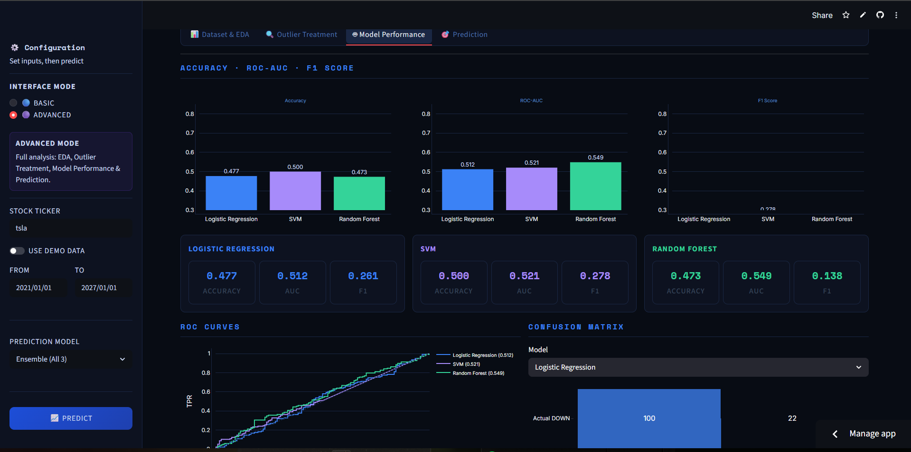

*Model Performance Visualization*

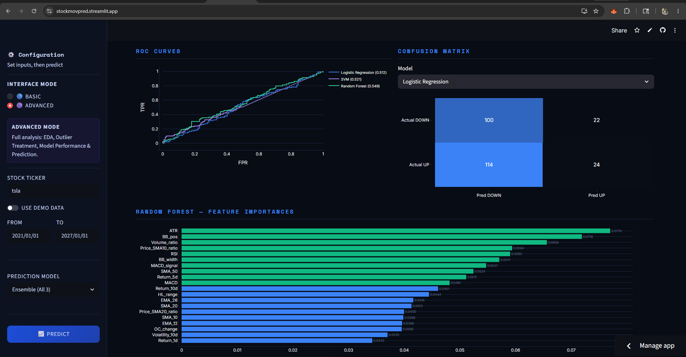

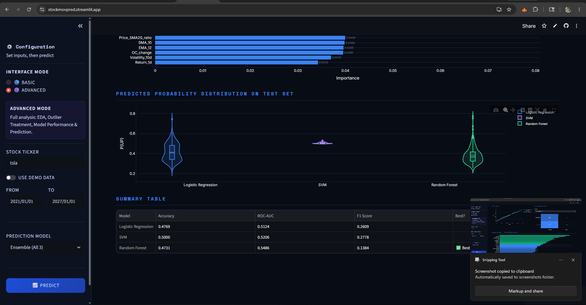

*Prediction tab*

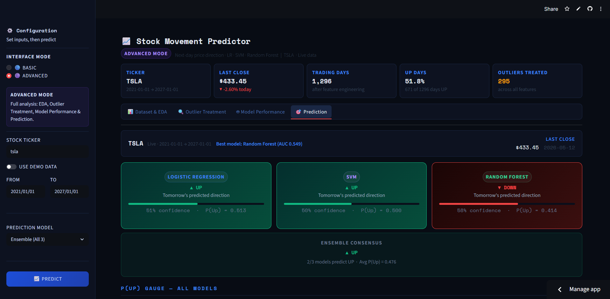

*Prediction Visualization *

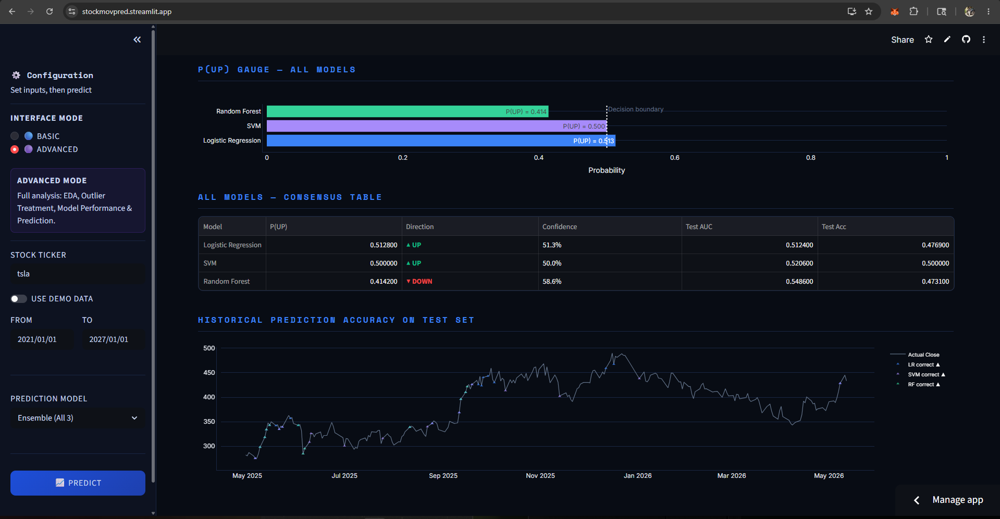


</div>

---

## 📚 Educational Purpose

This project was developed as an internship/project work.

It demonstrates practical applications of:

- Data Analytics
- Financial Machine Learning
- Predictive Modeling
- Data Preprocessing
- Interactive Dashboard Development

---

## ⚠️ Disclaimer

This project is developed for educational and research purposes only.

Stock market predictions are based on historical data and machine learning patterns and should not be considered financial advice.

---

## 👨‍💻 Author

Developed by **Sheikh Tauheed**

Internship Project – CSE(Iot, CS including BCT)

**LinkedIn**: [Sheikh Tauheed](https://www.linkedin.com/in/sheikh-tauheed-82100026a/)

**Github**: [Sheikh-13](https://github.com/Sheikh-13)

---

## ⭐ Future Improvements

- LSTM / Deep Learning integration
- Live intraday prediction
- News sentiment analysis
- Portfolio optimization
- Model hyperparameter tuning
- Deployment on cloud platforms
